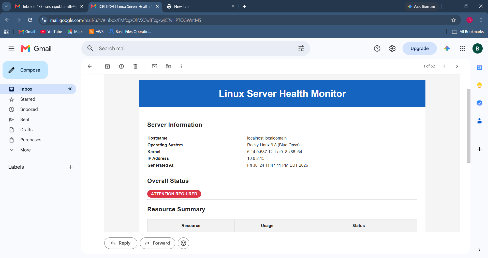
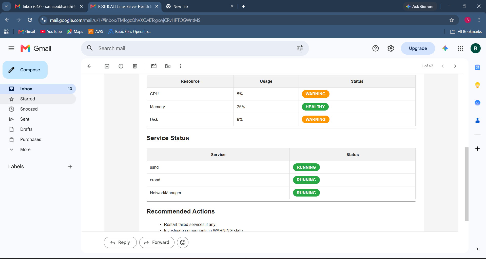
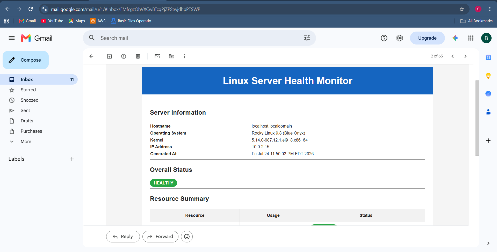
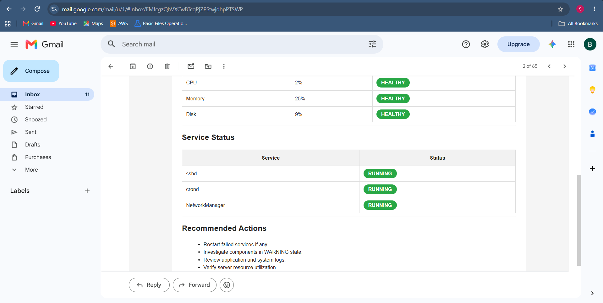

# Linux Server Health Monitor

## Overview

Linux Server Health Monitor is a modular server monitoring solution built using Bash and Python that automates Linux health checks, service monitoring, incident detection, and email alerting.

The project follows a production-inspired architecture by separating data collection from presentation. Bash collects system metrics and generates structured JSON reports, while Python converts the collected data into professional HTML email dashboards delivered through Gmail SMTP.

The project demonstrates Linux system administration, automation, monitoring, alerting, logging, incident detection, JSON data processing, and operational reporting practices commonly used in DevOps and Site Reliability Engineering (SRE).

---

## Project Highlights

- Automated Linux Server Health Monitoring
- Modular Bash Architecture
- JSON-Based Monitoring Reports
- Professional HTML Email Dashboard
- Service Availability Monitoring
- Incident Detection & Alerting
- Cron-Based Scheduled Execution
- Log Rotation & Retention
- Gmail SMTP Email Notifications
- Secure Credential Management
- Git Version Controlled Development

---

## Key Features

### System Monitoring

* CPU utilization monitoring
* Memory utilization monitoring
* Disk utilization monitoring
* System uptime tracking
* Hostname information collection
* Logged-in user monitoring
* Top memory-consuming process tracking

### Service Monitoring

* SSH service monitoring
* Cron service monitoring
* NetworkManager monitoring
* Service failure detection
* Critical service health checks

### Logging & Reporting

- Automated health report generation
- JSON report generation
- Historical report storage
- HTML dashboard generation
- Alert logging
- Incident tracking
- Health status classification (HEALTHY / WARNING)

### Automation & Alerting

* Cron-based scheduled execution
* Automated incident detection
* Gmail SMTP email notifications
* Detailed health alert emails
* Secure credential management using config.env

### Log Rotation
* Automated log rotation
* Log retention management

---

## Technologies Used

- Linux (Rocky Linux / RHEL)
- Bash Scripting
- Python 3
- JSON
- HTML & CSS
- Gmail SMTP
- Cron
- Git
- GitHub

---

## Project Structure

```text
linux-server-health-monitor/

├── config.conf
├── config.env
├── README.md
├── .gitignore

├── logs/
│   ├── health_report.log
│   └── alerts.log

├── reports/
│   └── server_report.json

├── screenshots/

└── scripts/
    ├── monitor.sh
    ├── logger.sh
    ├── utils.sh
    └── send_alert.py
```

---

## Monitoring Workflow

```text
                 monitor.sh
                      │
                      ▼
          Collect System Metrics
                      │
                      ▼
          Evaluate Resource Health
                      │
                      ▼
          Generate server_report.json
                      │
        ┌─────────────┴─────────────┐
        ▼                           ▼
Terminal Dashboard          send_alert.py
                                    │
                                    ▼
                    Generate HTML Dashboard
                                    │
                                    ▼
                         Gmail SMTP Delivery
```
## Sample Output

The monitoring solution generates:

- Interactive terminal health dashboard
- JSON monitoring report
- Professional HTML email report
- Historical monitoring logs
- Alert logs
- Service status summary
- Overall health assessment

---


## Architecture

```text
                Linux Server

                     │
                     ▼

            monitor.sh (Bash)

     ┌──────────────┼──────────────┐
     ▼              ▼              ▼

 Terminal       health_report.log   server_report.json

                                      │

                                      ▼

                          send_alert.py (Python)

                                      │

                                      ▼

                        HTML Email Dashboard

                                      │

                                      ▼

                           Gmail SMTP Server

                                      │

                                      ▼

                                 Administrator
```


## Screenshots

### Monitoring Report


### Git Commit History


### Healthy Server


### Attention Required


### Services Running


### Attention Required (Service Warning)


### Service Failure Alert


### Email Sent Successfully


### Email Alert Received


### Email Alert(Critical) Content



 

### Email Alert(OK) Content






---

## Current Version

**Latest Release:** V10.0

### Completed Milestones

| Version | Feature |
|----------|---------------------------------------------|
| V1 | Basic Server Monitoring |
| V2 | Report Logging |
| V3 | Memory & Disk Monitoring |
| V4 | CPU Monitoring |
| V5 | Overall Health Summary |
| V6 | Cron Automation |
| V7 | Service Monitoring |
| V8 | Incident Logging |
| V9 | Gmail SMTP Alerts |
| V9.1 | Enhanced Email Content |
| V10 | Log Rotation |
| V10.1 | Modular Bash Architecture |
| V10.2 | JSON Report Generation |
| V10.3 | HTML Dashboard Email |

---

## Release History

### Version 1.0

* Basic server monitoring
* Hostname information
* System uptime monitoring
* User session monitoring
* Process monitoring

### Version 2.0

* Report logging functionality
* Health report persistence

### Version 3.0

* Memory utilization monitoring
* Disk utilization monitoring
* Threshold-based health checks

### Version 4.0

* CPU utilization monitoring
* CPU health status reporting

### Version 5.0

* Overall server health summary
* Consolidated CPU, Memory, and Disk status reporting
* ATTENTION REQUIRED / HEALTHY status classification

### Version 6.0

* Cron-based automation
* Automated report generation
* Scheduled execution every 5 minutes

### Version 7.0

* Critical service monitoring
* SSHD monitoring
* Cron monitoring
* NetworkManager monitoring
* Service health integration

### Version 8.0

* Alert engine implementation
* Incident logging
* Failed service tracking
* alerts.log generation

### Version 9.0

* Gmail SMTP integration
* Automated email notifications
* Secure credential management using config.env

### Version 9.1

* Enhanced email alert content
* Detailed health summary emails
* Failed service information included in alerts
* Professional email formatting

### V10 - Log Rotation & Retention

- Added automated log rotation
- Prevents excessive log growth
- Maintains historical log archives
- Added rotation activity logging

---

## Skills Demonstrated

- Linux Administration
- Bash Scripting
- Python Automation
- JSON Data Processing
- HTML Email Generation
- Linux Service Management
- System Monitoring
- Incident Detection
- Log Rotation
- Cron Automation
- SMTP Email Integration
- Production Logging
- Git Version Control
- Shell Script Modularization
---

## Future Enhancements

- Docker Container Support
- Multi-Server Monitoring
- AWS EC2 Deployment
- Configuration Dashboard
- Slack / Microsoft Teams Notifications
- REST API Integration
- Web Dashboard
- Grafana Visualization
- Prometheus Exporter
- Kubernetes Deployment

---

## Project Metrics

- 4 Modular Scripts
- 10+ Monitoring Features
- 3 Critical Services Monitored
- JSON-Based Reporting
- HTML Email Dashboard
- Automated Incident Detection
- Gmail SMTP Integration
- Cron-Based Automation

  
## Author

**Bharath Chand Seshapu**

MCA Graduate | Linux Administrator Aspirant | RHCSA Learner | Cloud & DevOps Enthusiast

