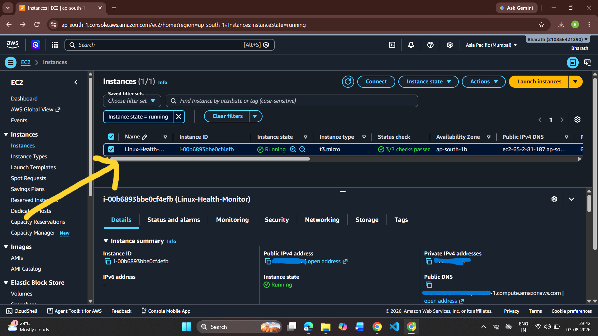

# Linux Server Health Monitor

## Overview

A production-style Linux Server Health Monitoring solution built using Bash and Python that automates server health checks, service monitoring, alerting, reporting, and incident notifications.

The project follows Linux Administration and DevOps best practices by implementing modular scripting, configurable monitoring thresholds, log rotation, JSON report generation, state-based email notifications, automated installation, and cross-platform compatibility across Rocky Linux and Amazon Linux.

## Project Highlights

- Automated Linux Server Health Monitoring
- Modular Bash Script Architecture
- Cron-Based Scheduled Monitoring
- Cross-Distribution Linux Support
- State-Based Email Notifications
- JSON Health Report Generation
- Log Rotation & Retention
- Automated Installation Script
- Secure Credential Management
- Git Version Controlled Development

---

## Key Features

### System Monitoring

* CPU utilization monitoring
* Memory utilization monitoring
* Disk utilization monitoring
* System uptime tracking
* Hostname information collection
* Logged-in user monitoring
* Top memory-consuming process tracking

### Service Monitoring

* SSH service monitoring
* Cron service monitoring
* NetworkManager monitoring
* Service failure detection
* Critical service health checks

### Logging & Reporting

- Automated health report generation
- JSON report generation
- Structured monitoring reports
- Runtime state tracking
- Historical report storage
- HTML dashboard generation
- Alert logging
- Incident tracking
- Health status classification (HEALTHY / WARNING)

### Automation & Alerting

- Cron-based scheduled monitoring
- State-based email notifications
- Automatic recovery notifications
- Gmail SMTP email alerts
- Alert suppression (prevents duplicate emails)
- Secure credential management

### Cross-Platform Compatibility

- Rocky Linux 9
- Amazon Linux 2023
- Portable project structure
- Dynamic path resolution using BASE_DIR
- Automatic detection of unavailable services

### Intelligent Alert Management

The monitoring system maintains the previous server health state and sends notifications **only when the server status changes**.

This prevents duplicate alerts during scheduled monitoring while ensuring administrators receive notifications whenever the server enters or recovers from an unhealthy state.

State transitions include:

- HEALTHY → ATTENTION REQUIRED
- ATTENTION REQUIRED → HEALTHY
- HEALTHY → WARNING
- WARNING → HEALTHY
- Service Failure Detection
- Service Recovery Detection

  
### Log Rotation
* Automated log rotation
* Log retention management

---

## Technologies Used

- Linux (Rocky Linux / RHEL)
- Bash Scripting
- Python 3
- JSON
- HTML & CSS
- Gmail SMTP
- Cron
- Git
- GitHub

---

## Project Structure

```text
linux-server-health-monitor/
├── config/
│   ├── config.conf
│   └── config.env
├── logs/
│   ├── health_report.log
│   ├── alerts.log
│   └── server_state.txt
├── reports/
│   └── server_report.json
├── screenshots/
├── scripts/
│   ├── monitor.sh
│   ├── logger.sh
│   ├── utils.sh
│   └── send_alert.py
├── install.sh
├── .gitignore
└── README.md
```
---

## Monitoring Workflow

```text
                monitor.sh
                     │
                     ▼
          Load Configuration
                     │
                     ▼
       Collect System Information
                     │
                     ▼
       Monitor CPU / Memory / Disk
                     │
                     ▼
         Check Configured Services
                     │
                     ▼
       Generate JSON Health Report
                     │
                     ▼
      Compare Previous Server State
                     │
          ┌──────────┴──────────┐
          │                     │
     No State Change      State Changed
          │                     │
          ▼                     ▼
     Skip Email          Send Email Alert
          │                     │
          └──────────┬──────────┘
                     ▼
          Update Health Logs
```
## Intelligent Alert Flow

```text
Cron Scheduler (Every 5 Minutes)

          │

          ▼

Collect Server Metrics

          │

          ▼

Determine Overall Health

          │

          ▼

Read Previous Status

          │

          ▼

Status Changed?

     ┌───────────────┐

   No │               │ Yes

      ▼               ▼

 Skip Email      Generate Alert

                     │

                     ▼

          Send HTML Email Report

                     │

                     ▼

        Update Previous State File
```

## Sample Output

The monitoring solution generates:

- Interactive terminal health dashboard
- JSON monitoring report
- Professional HTML email dashboard
- Historical monitoring logs
- Alert logs
- Intelligent state-based email notifications
- Recovery acknowledgement emails
- Service status summary
- Overall health assessment
---


## Architecture

```text
                Linux Server

                     │
                     ▼

            monitor.sh (Bash)

     ┌──────────────┼──────────────┐
     ▼              ▼              ▼

 Terminal       health_report.log   server_report.json

                                      │

                                      ▼

                          send_alert.py (Python)

                                      │

                                      ▼

                        HTML Email Dashboard

                                      │

                                      ▼

                           Gmail SMTP Server

                                      │

                                      ▼

                                 Administrator
```


## Screenshots

### Monitoring Report


### Git Commit History


### Healthy Server


### Attention Required


### Services Running


### Attention Required (Service Warning)


### Service Failure Alert


### Email Sent Successfully


### Email Alert Received


### Email Alert(Critical) Content


 

### Email Alert(OK) Content


### AWS EC2 Deployment




---

## Current Version

**Latest Release:** V10.5.1

### Completed Milestones

| Version | Feature |
|----------|----------------------------------------------|
| V1 | Basic Server Monitoring |
| V2 | Report Logging |
| V3 | Memory & Disk Monitoring |
| V4 | CPU Monitoring |
| V5 | Overall Health Summary |
| V6 | Cron Automation |
| V7 | Service Monitoring |
| V8 | Incident Logging |
| V9 | Gmail SMTP Alerts |
| V9.1 | Enhanced Email Content |
| V10 | Log Rotation |
| V10.1 | Modular Bash Architecture |
| V10.2 | JSON Report Generation |
| V10.3 | HTML Dashboard Email |
| V10.4 | State-Based Intelligent Alerting |
| V10.5 | AWS EC2 Deployment |
| V10.5.1 | Cross-Platform Service Detection & Deployment Stabilization |
---

## Release History

### Version 1.0

* Basic server monitoring
* Hostname information
* System uptime monitoring
* User session monitoring
* Process monitoring

### Version 2.0

* Report logging functionality
* Health report persistence

### Version 3.0

* Memory utilization monitoring
* Disk utilization monitoring
* Threshold-based health checks

### Version 4.0

* CPU utilization monitoring
* CPU health status reporting

### Version 5.0

* Overall server health summary
* Consolidated CPU, Memory, and Disk status reporting
* ATTENTION REQUIRED / HEALTHY status classification

### Version 6.0

* Cron-based automation
* Automated report generation
* Scheduled execution every 5 minutes

### Version 7.0

* Critical service monitoring
* SSHD monitoring
* Cron monitoring
* NetworkManager monitoring
* Service health integration

### Version 8.0

* Alert engine implementation
* Incident logging
* Failed service tracking
* alerts.log generation

### Version 9.0

* Gmail SMTP integration
* Automated email notifications
* Secure credential management using config.env

### Version 9.1

* Enhanced email alert content
* Detailed health summary emails
* Failed service information included in alerts
* Professional email formatting

### V10 - Log Rotation & Retention

- Added automated log rotation
- Prevents excessive log growth
- Maintains historical log archives
- Added rotation activity logging

### Version 10.4

- Implemented intelligent state-aware alerting
- Added server_state.txt for previous status tracking
- Prevented duplicate email notifications
- Added automatic recovery notifications
- Alert emails are triggered only on health state transitions
- Reduced notification noise during cron-based monitoring
- Improved monitoring workflow to match enterprise monitoring practices

### Version 10.5.1

- Fixed repeated email notifications
- Added state-based alert mechanism
- Added server_state tracking
- Improved AWS deployment
- Replaced hardcoded paths with dynamic BASE_DIR
- Improved cross-platform compatibility
- Added automatic detection of unavailable services
- Improved installer reliability
- Refactored project for production deployment
---

## Skills Demonstrated

- Linux System Administration
- Shell Scripting
- Python Automation
- Infrastructure Monitoring
- JSON Data Generation
- State Management
- Linux Services Management
- AWS EC2 Deployment
- Cross-Platform Scripting
- Git Workflow
- SMTP Email Integration
---

## Future Enhancements

- Docker Containerization
- Docker Compose
- GitHub Actions CI/CD
- Multi-Server Monitoring
- Slack / Microsoft Teams Notifications
- Web Dashboard
- REST API Integration
- Prometheus Exporter
- Grafana Dashboard
- AWS CloudWatch Integration

---

## Project Metrics

- 4 Modular Scripts
- 10+ Monitoring Features
- 3 Critical Services Monitored
- JSON-Based Reporting
- HTML Email Dashboard
- Intelligent State-Based Alerting
- Automated Recovery Notifications
- Cron-Based Automation
- Gmail SMTP Integration
- Modular Linux Monitoring Architecture

  
## Author

**Bharath Chand Seshapu**

MCA Graduate | Linux Administrator Aspirant | RHCSA Learner | Cloud & DevOps Enthusiast

