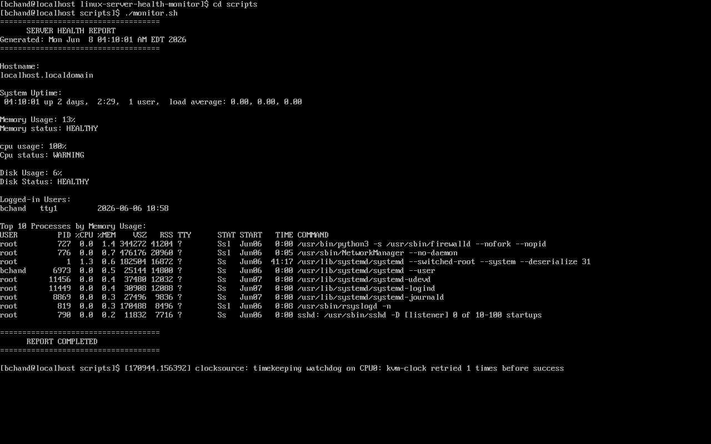
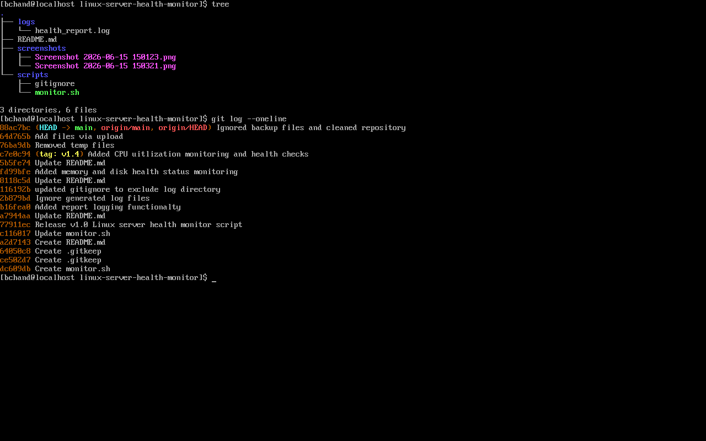
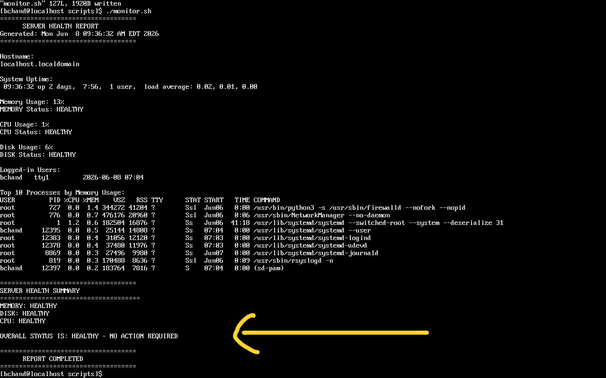
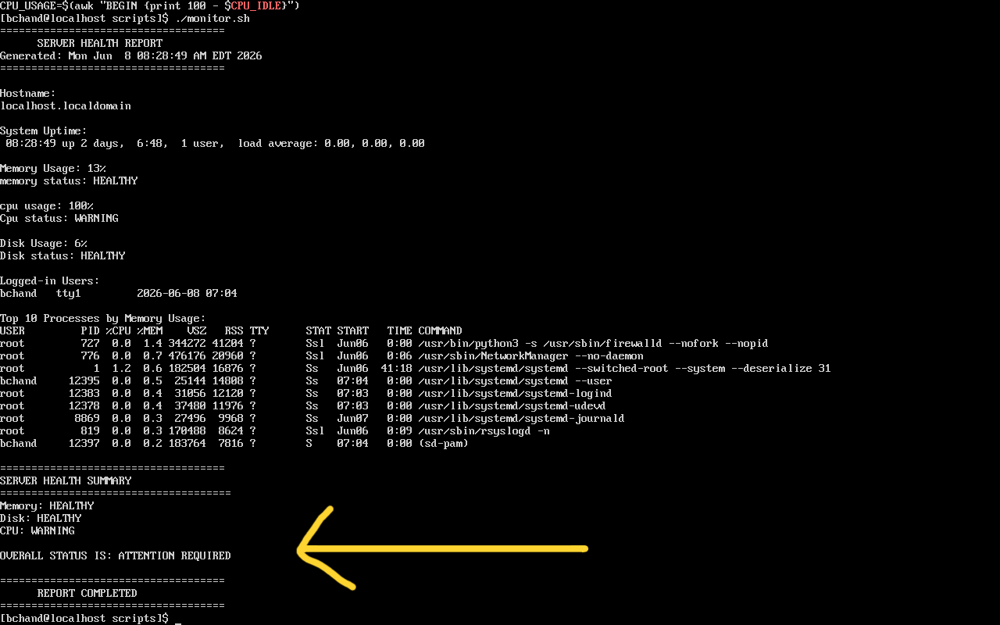
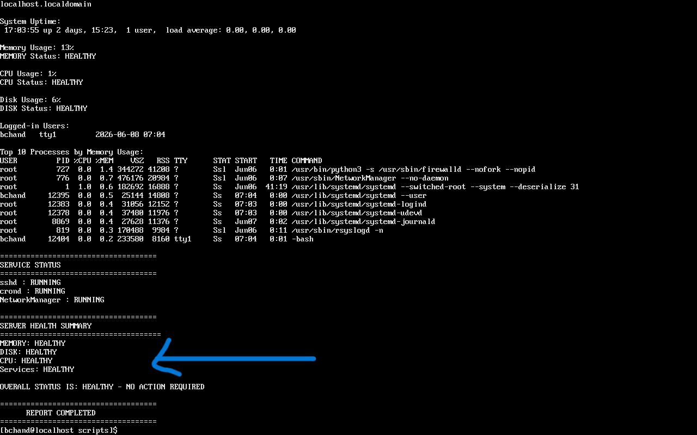
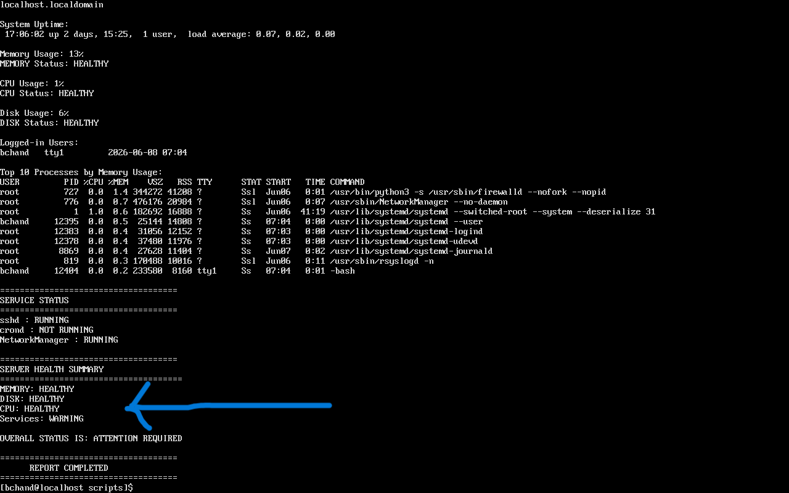
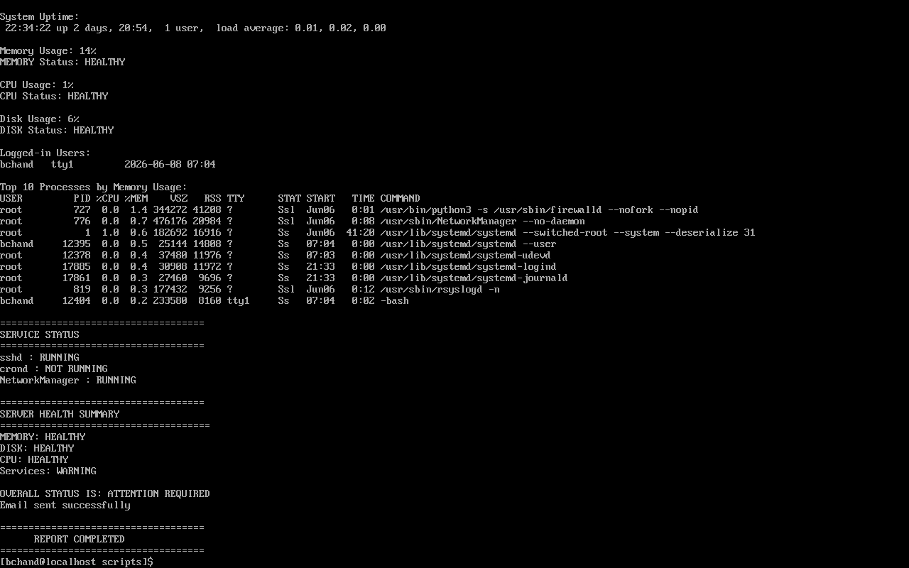
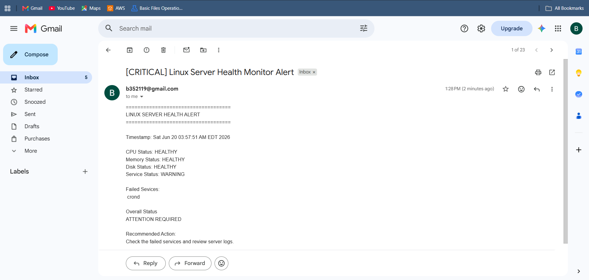

# Linux Server Health Monitor

## Overview

Linux Server Health Monitor is a Bash-based monitoring utility designed to automate the collection and analysis of critical Linux server health metrics. The tool helps system administrators and support engineers monitor CPU, memory, and disk utilization while maintaining historical logs for troubleshooting and operational analysis.


## Features

- CPU utilization monitoring
- Memory utilization monitoring
- Disk utilization monitoring
- Health status checks (HEALTHY/WARNING)
- Overall server health summary
- Service availability monitoring
- Critical service health checks (sshd, crond, NetworkManager)
- Logged-in user monitoring
- Top memory-consuming processes
- Report logging
- Cron-based automation
- Alert generation for warning conditions
- Incident logging through alerts.log
- Service failure tracking
- Automated email notifications
- Gmail SMTP integration
- Incident alert logging
- Service monitoring
  
## Technologies Used

* Linux (RHEL)
* Bash Scripting
* Git
* GitHub

## Project Structure

## Project Structure 

```text
linux-server-health-monitor/
├── logs/
│   ├── health_report.log
│   └── alerts.log
├── screenshots/
├── scripts/
│   └── monitor.sh
├── .gitignore
└── README.md
```

## Sample Output

The monitoring script generates a server health report containing:

* CPU Usage and Status
* Memory Usage and Status
* Disk Usage and Status
* Logged-in Users
* Top Processes by Memory Consumption
* System Uptime
* Hostname Information

### Monitoring Report



### Git Commit History



### Healthy Server



### Attention Required



### Services Running



### Attention Required (Service warning)



### Service Failure (Alert will be generated with service details)


### Email Alert sent successfully 


### Email Alert



## Release History

### Version 1.0

* Basic server monitoring
* Hostname, uptime, memory, disk, user and process information

### Version 2.0

* Report logging functionality
* Health report persistence

### Version 3.0

* Memory utilization monitoring
* Disk utilization monitoring
* Threshold-based health checks

### Version 4.0

* CPU utilization monitoring
* CPU health status reporting

### Version 5.0

* Added overall server health summary
* Consolidated CPU, Memory, and Disk status
* Added ATTENTION REQUIRED / HEALTHY status reporting

### V6 - Cron Automation

- Added cron scheduling
- Automated health report generation
- Reports generated every 5 minutes (configurable)
- No manual execution required

### V7
- Added service monitoring
- Monitors sshd, crond, and NetworkManager services
- Integrated service health into overall server status
- Generates warning when critical services are unavailable

### V8
- Added alert engine
- Generates alerts when warning conditions occur
- Stores incidents in alerts.log
- Tracks failed services

### V9 - Email Alerting System

- Added Gmail SMTP email notifications
- Integrated monitoring with automated alerts
- Added alert logging
- Secured credentials using config.env

### V9.1 - Enhanced The Alert Email Content

- Added detailed information about the server health alert

## Skills Demonstrated

* Linux Administration
* Bash Scripting
* System Monitoring
* Log Management
* Git Version Control
* Troubleshooting
* Process Monitoring
* System Health Assessment
* Monitoring Automation

## Future Enhancements

- Email alerts for warning conditions
- Log rotation and archiving
- AWS EC2 deployment
- Multi-server monitoring
- Custom threshold configuration
- Web dashboard for health reports


## Author

Bharath Chand Seshapu
MCA Graduate | Linux & Cloud Enthusiast | RHCSA Learner

