# Linux Server Health Monitor

## Overview

A production-style Linux Server Health Monitoring solution built using Bash and Python that automates server health checks, service monitoring, alerting, reporting, incident notifications, and containerized deployment.

The project follows Linux Administration and DevOps practices by implementing modular scripting, configurable monitoring thresholds, log rotation, JSON report generation, state-based email notifications, automated installation, cross-platform compatibility, Docker containerization, Docker Compose deployment, and AWS EC2 deployment.

The containerized deployment is designed to monitor the **underlying Linux host**, rather than only the Docker container.

---

## Project Highlights

- Automated Linux Server Health Monitoring
- Modular Bash Script Architecture
- Docker Containerized Monitoring
- Docker Compose Deployment
- Host-Level Monitoring from Container
- Cron-Based Scheduled Monitoring
- Cross-Distribution Linux Support
- State-Based Email Notifications
- JSON Health Report Generation
- Log Rotation & Retention
- Automated Installation Script
- Secure Credential Management
- AWS EC2 Deployment
- Git Version Controlled Development

---

## Key Features

### System Monitoring

- CPU utilization monitoring
- Memory utilization monitoring
- Disk utilization monitoring
- System uptime tracking
- Hostname information collection
- Logged-in user monitoring
- Top memory-consuming process tracking
- Operating system detection
- Kernel information collection
- IP address detection

### Service Monitoring

- SSH service monitoring
- Cron service monitoring
- NetworkManager monitoring
- Service failure detection
- Critical service health checks
- Automatic detection of unavailable services
- Cross-distribution service compatibility

### Logging & Reporting

- Automated health report generation
- JSON report generation
- Structured monitoring reports
- Runtime state tracking
- Historical monitoring logs
- HTML email dashboard generation
- Alert logging
- Incident tracking
- Log rotation and retention
- Resource health status classification
- Overall server health classification

### Automation & Alerting

- Cron-based scheduled monitoring
- State-based email notifications
- Automatic recovery notifications
- Gmail SMTP email alerts
- Alert suppression to prevent duplicate emails
- Secure credential management
- Email failure handling

### Cross-Platform Compatibility

- Rocky Linux 9
- Amazon Linux 2023
- Portable project structure
- Dynamic path resolution using `BASE_DIR`
- Automatic detection of unavailable services
- Distribution-aware operating system detection

### Containerized Deployment

The monitoring solution supports Docker-based deployment while continuing to monitor the underlying Linux host.

Docker Compose is configured with:

- Host PID namespace access
- Host network namespace
- Read-only access to the host filesystem
- Read-only access to the host `/run` directory
- Persistent mounts for logs and reports
- Read-only access to email configuration

This allows the containerized monitor to collect host-level CPU, memory, disk, process, network, operating system, and systemd service information.

The monitor is executed as a temporary container using:

```bash
docker compose run --rm monitor

The container is automatically removed after each monitoring execution.
Intelligent Alert Management
The monitoring system maintains the previous server health state and sends notifications only when the server status changes.
This prevents duplicate alerts during scheduled monitoring while ensuring administrators receive notifications whenever the server enters or recovers from an unhealthy state.

###State Transitions
```text
HEALTHY
    │
    ▼
ATTENTION REQUIRED
    │
    ├── Same state → No email
    │
    ▼
HEALTHY
    │
    ▼
Recovery email

Typical transitions include:
HEALTHY → ATTENTION REQUIRED
ATTENTION REQUIRED → HEALTHY

Resource-level conditions such as high CPU, high memory, high disk usage, or stopped services can cause the overall server status to become ATTENTION REQUIRED.
Alert Suppression
If the server remains in the same state:
ATTENTION REQUIRED → ATTENTION REQUIRED

the monitor skips the email notification.
This prevents receiving an alert every five minutes while the same issue remains unresolved.

###Log Rotation
- Automated log rotation
- Log retention management
- Prevents excessive log growth
- Maintains historical log archives
- Separate health and alert logs

###Technologies Used
- Linux (Rocky Linux / Amazon Linux)
- Bash Scripting
- Python 3
- Docker
- Docker Compose
- JSON
- HTML & CSS
- Gmail SMTP
- Cron
- AWS EC2
- Git
- GitHub

###Project Structure
```text
linux-server-health-monitor/
├── config/
│   ├── config.conf
│   └── config.env
├── logs/
│   ├── health_report.log
│   ├── alerts.log
│   └── server_state.txt
├── reports/
│   └── server_report.json
├── screenshots/
├── scripts/
│   ├── monitor.sh
│   ├── logger.sh
│   ├── utils.sh
│   └── send_alert.py
├── Dockerfile
├── compose.yaml
├── install.sh
├── .gitignore
└── README.md

config/config.env, runtime logs, runtime state, and generated reports are excluded from version control where applicable.

###Monitoring Workflow
```text
Cron Scheduler
      │
      ▼
Docker Compose
      │
      ▼
Start Monitor Container
      │
      ▼
Load Configuration
      │
      ▼
Collect Host System Information
      │
      ▼
Monitor CPU / Memory / Disk
      │
      ▼
Check Configured Services
      │
      ▼
Generate JSON Health Report
      │
      ▼
Compare Previous Server State
      │
      ├── No State Change
      │       │
      │       ▼
      │   Skip Email
      │
      └── State Changed
              │
              ▼
        Send Email Alert
              │
              ▼
        Update Health Logs
              │
              ▼
        Remove Temporary Container

###Intelligent Alert Flow
```text

Cron Scheduler
Every 5 Minutes
       │
       ▼
Docker Compose
       │
       ▼
Collect Server Metrics
       │
       ▼
Determine Overall Health
       │
       ▼
Read Previous Status
       │
       ▼
Status Changed?
       │
   ┌───┴───────────┐
   │               │
  No              Yes
   │               │
   ▼               ▼
Skip Email     Generate Alert
                   │
                   ▼
             Send HTML Email
                   │
                   ▼
          Update Previous State

###Architecture
```text
                         AWS EC2
                    Amazon Linux 2023
                           │
                           ▼
                  Cron Scheduler
                   Every 5 Minutes
                           │
                           ▼
                 Docker Compose
                           │
                           ▼
              ┌────────────────────────┐
              │   Monitor Container    │
              │                        │
              │     monitor.sh         │
              │          │             │
              │     ┌────┴────┐        │
              │     │         │        │
              │   Bash      Python    │
              │ Monitoring  Alerts    │
              └──────┬─────────┬───────┘
                     │         │
                     │         ▼
                     │     Gmail SMTP
                     │
             Host-Level Access
                     │
        ┌────────────┼───────────────┐
        │            │               │
        ▼            ▼               ▼
      CPU /       Processes       Services
      Memory      Network         systemd
      Disk        OS Info         sshd
                                 crond
                           NetworkManager
        │
        ▼
 Persistent Host Data
        │
   ┌────┴─────┐
   ▼          ▼
 logs/      reports/
   │          │
   ▼          ▼
Health Logs  JSON Report

###Container Host Access
The Docker deployment uses:
- pid: host for host process visibility
- network_mode: host for host networking
- /run:/run:ro for systemd service inspection
- /:/host:ro for host filesystem information
- ./logs:/app/logs for persistent monitoring logs
- ./reports:/app/reports for generated reports
- ./config/config.env:/app/config/config.env:ro for email configuration

###Docker Deployment
Prerequisites
- Linux host
- Bash
- Python 3
- Docker
- Docker Compose
- Cron

##Build the Docker Image
docker compose build

##Verify the Compose Configuration
docker compose config

##Run the Monitor Manually
docker compose run --rm monitor

###Automated Monitoring
The installer configures Cron to execute the Dockerized monitor every five minutes.
The resulting Cron job follows this format:
*/5 * * * * cd /path/to/linux-server-health-monitor && /usr/bin/docker compose run --rm monitor >/dev/null 2>&1

The actual installation directory is resolved dynamically by install.sh.
Install the Monitoring System
./install.sh

###The installer validates:
- Linux
- Bash
- Python
- Docker
- Docker Compose
- Cron
- Required project files
It also:
- Creates required directories
- Creates required log files
- Creates the email configuration template when required
- Applies executable permissions
- Configures the Docker Compose Cron job
- Verifies the installation

###Configuration
Monitoring Configuration
Monitoring thresholds and monitored services are defined in:
config/config.conf

##Example configuration values include:
CPU_THRESHOLD
MEMORY_THRESHOLD
DISK_THRESHOLD
SERVICES

##Email Configuration
Email credentials are stored in:
config/config.env

Example:
SENDER_EMAIL=
APP_PASSWORD=
RECEIVER_EMAIL=

The file contains sensitive credentials and should not be committed to Git.
The Docker Compose configuration mounts this file into the container as read-only configuration.

###Sample Output
The monitoring solution generates:
- Interactive terminal health dashboard
- JSON monitoring report
- Professional HTML email dashboard
- Historical monitoring logs
- Alert logs
- Intelligent state-based email notifications
- Recovery acknowledgement emails
- Service status summary
- Overall health assessment


## Screenshots

### Monitoring Report

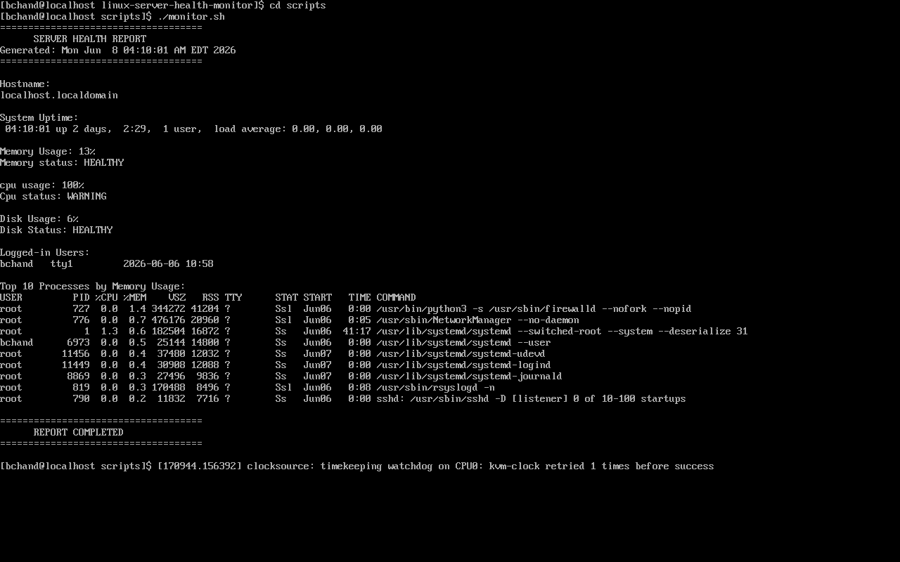

### Git Commit History

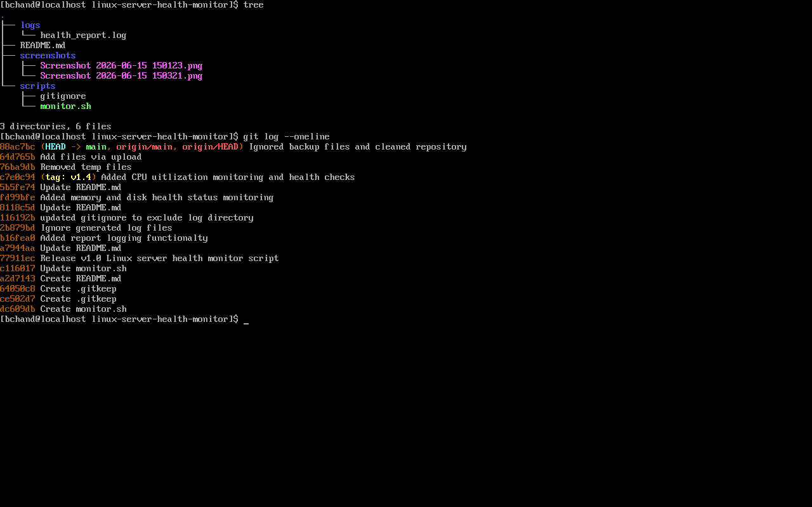

### Healthy Server

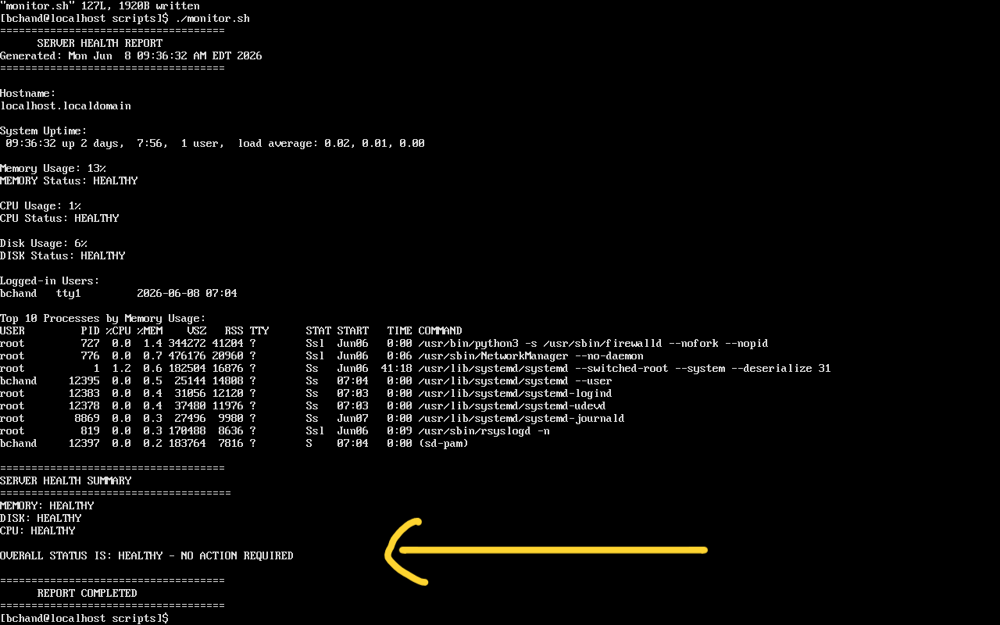

### Attention Required

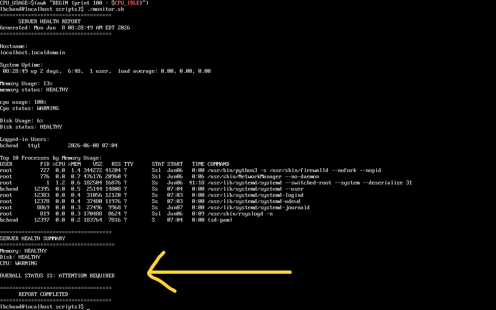

### Services Running

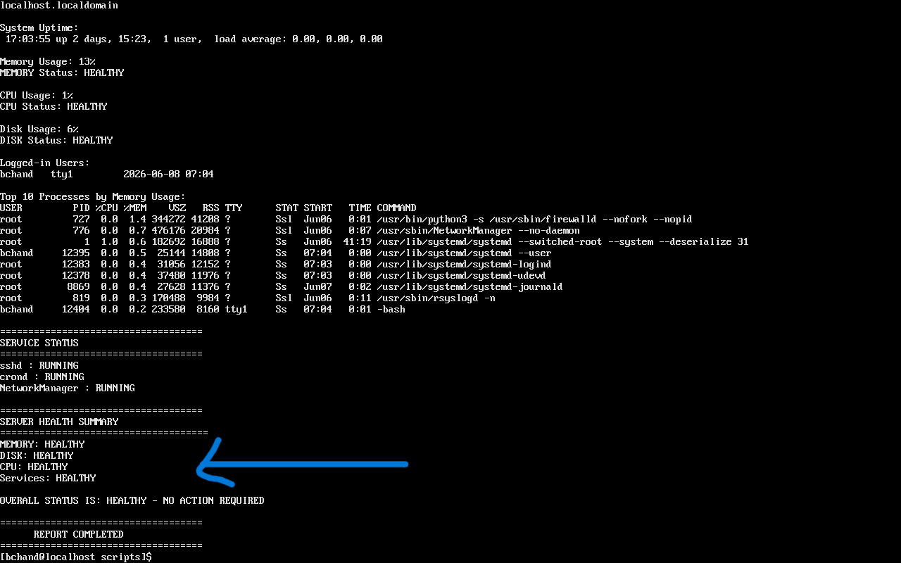

### Attention Required (Service Warning)

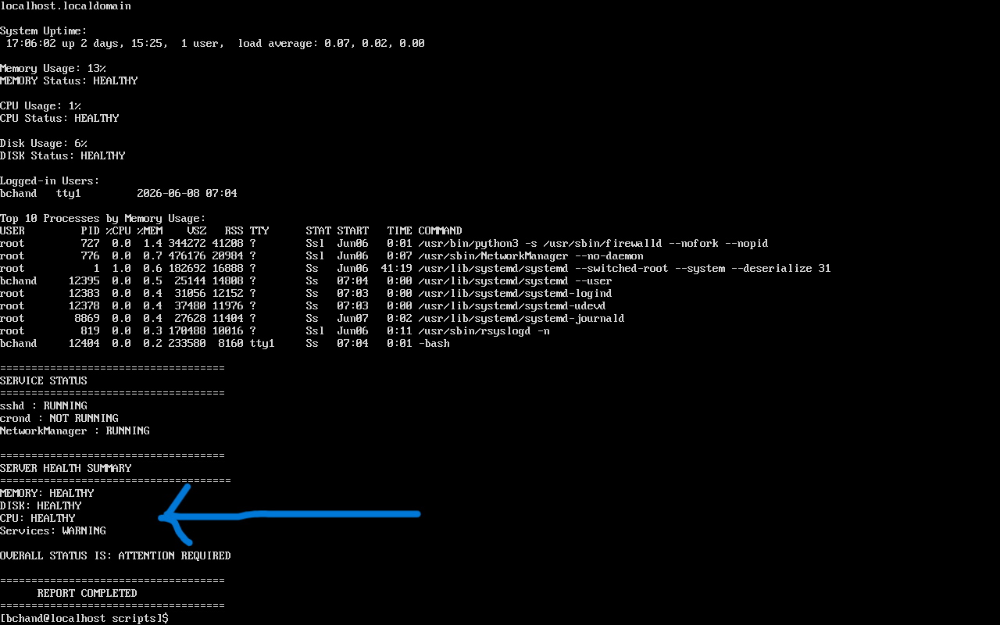

### Service Failure Alert

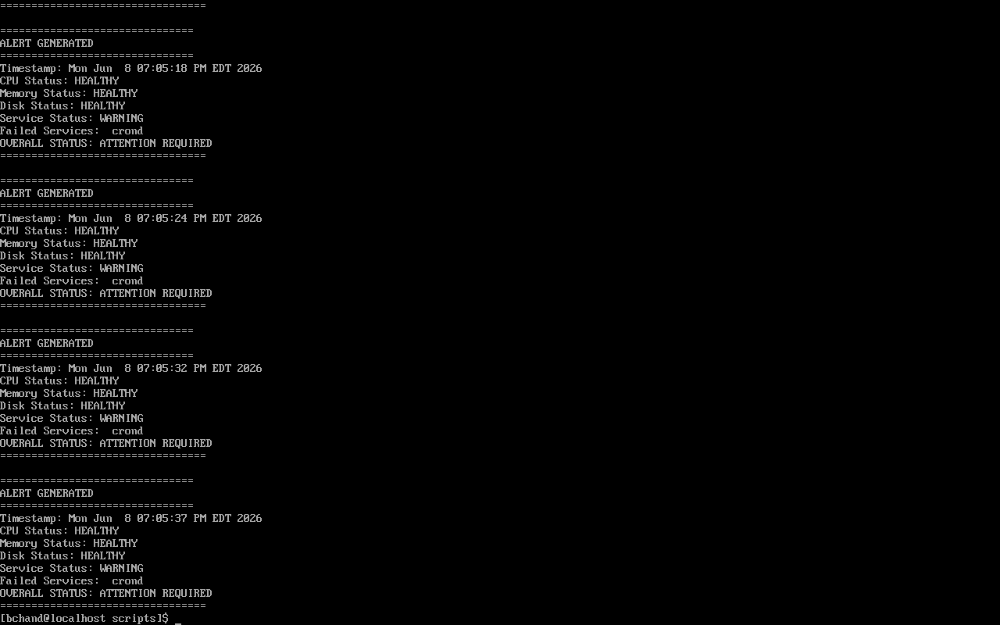

### Email Sent Successfully

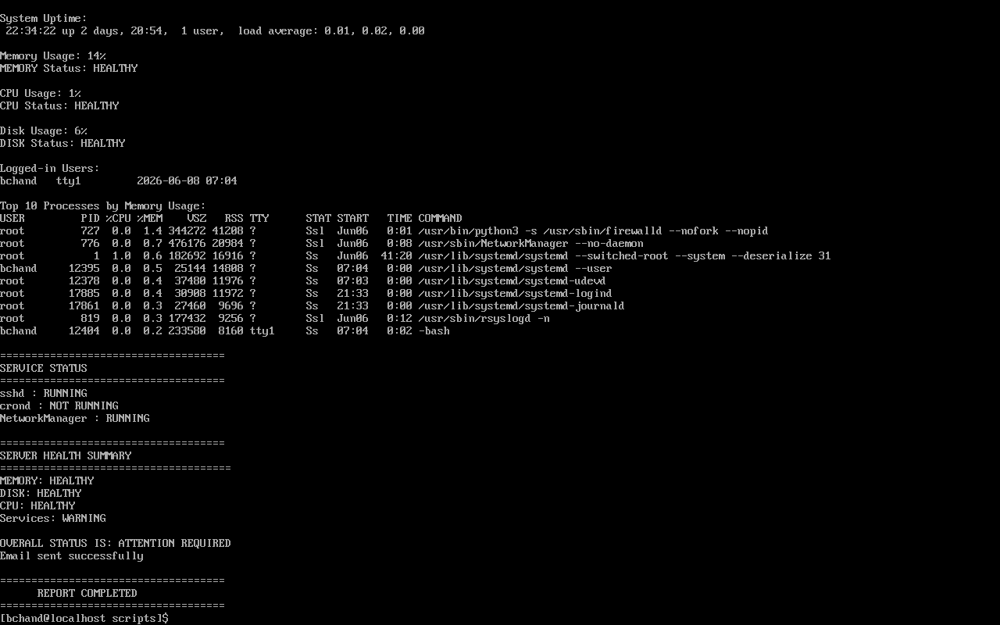

### Email Alert Received

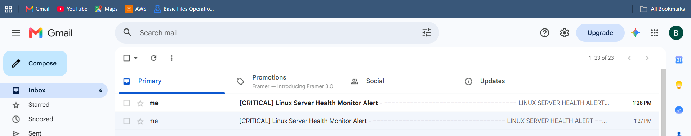

### Email Alert(Critical) Content

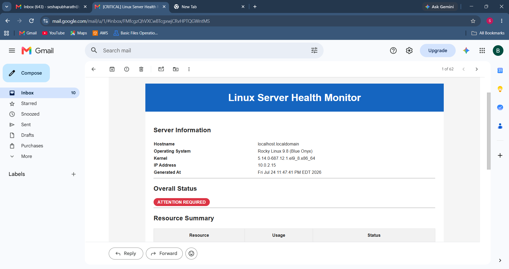

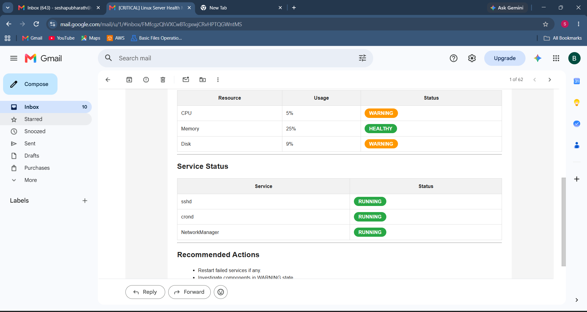 

### Email Alert(OK) Content

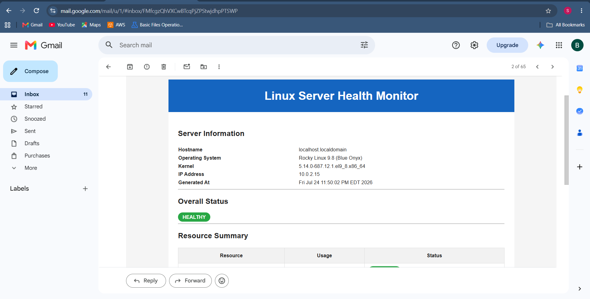

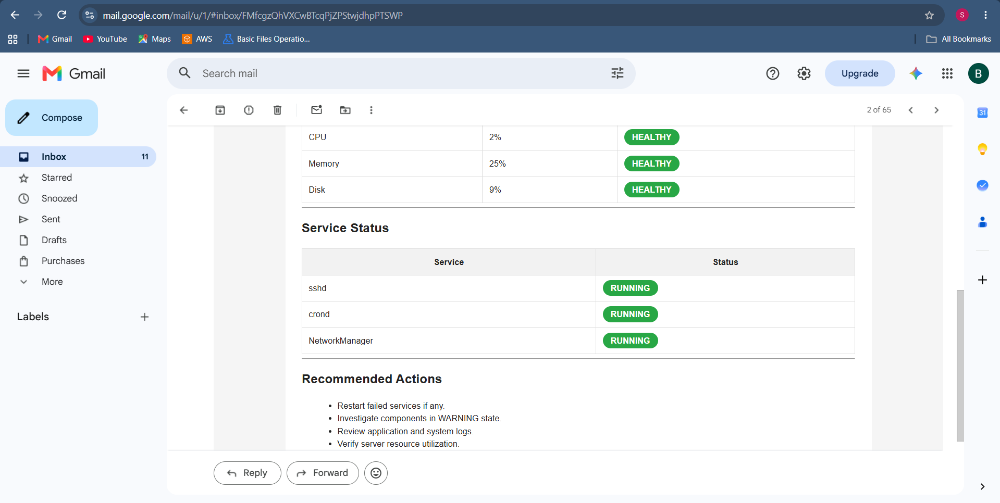

### AWS EC2 Deployment

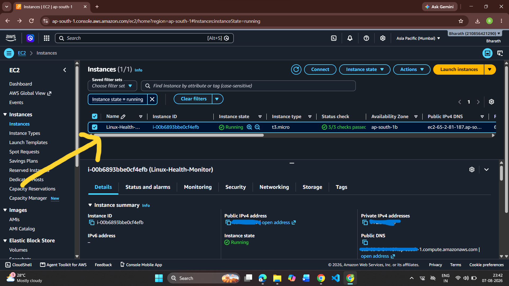


---

###Current Version
Latest Release: v10.6.0

##Completed Milestones
Version	Feature
V1	Basic Server Monitoring
V2	Report Logging
V3	Memory & Disk Monitoring
V4	CPU Monitoring
V5	Overall Health Summary
V6	Cron Automation
V7	Service Monitoring
V8	Incident Logging
V9	Gmail SMTP Alerts
V9.1	Enhanced Email Content
V10	Log Rotation
V10.1	Modular Bash Architecture
V10.2	JSON Report Generation
V10.3	HTML Dashboard Email
V10.4	State-Based Intelligent Alerting
V10.5	AWS EC2 Deployment
V10.5.1	Cross-Platform Service Detection & Deployment Stabilization
V10.6.0	Docker Containerization, Docker Compose & Host-Level Monitoring


###Release History
##Version 1.0
- Basic server monitoring
- Hostname information
- System uptime monitoring
- User session monitoring
- Process monitoring
##Version 2.0
- Report logging functionality
- Health report persistence
##Version 3.0
- Memory utilization monitoring
- Disk utilization monitoring
- Threshold-based health checks
##Version 4.0
- CPU utilization monitoring
- CPU health status reporting
##Version 5.0
- Overall server health summary
- Consolidated CPU, Memory, and Disk status reporting
- ATTENTION REQUIRED / HEALTHY status classification
##Version 6.0
- Cron-based automation
- Automated report generation
- Scheduled execution every 5 minutes
##Version 7.0
- Critical service monitoring
- SSHD monitoring
- Cron monitoring
- NetworkManager monitoring
- Service health integration
##Version 8.0
- Alert engine implementation
- Incident logging
- Failed service tracking
- alerts.log generation
##Version 9.0
- Gmail SMTP integration
- Automated email notifications
- Secure credential management using config.env
##Version 9.1
- Enhanced email alert content
- Detailed health summary emails
- Failed service information included in alerts
- Professional email formatting
##V10 - Log Rotation & Retention
- Added automated log rotation
- Prevents excessive log growth
- Maintains historical log archives
- Added rotation activity logging
##Version 10.4
- Implemented intelligent state-aware alerting
- Added server_state.txt for previous status tracking
- Prevented duplicate email notifications
- Added automatic recovery notifications
- Alert emails triggered only on health state transitions
- Reduced notification noise during Cron-based monitoring
- Improved monitoring workflow for production-style monitoring
##Version 10.5.1
- Improved AWS deployment
- Replaced hardcoded paths with dynamic BASE_DIR
- Improved cross-platform compatibility
- Added automatic detection of unavailable services
- Improved installer reliability
- Refactored project for production deployment
##Version 10.6.0
- Added Docker containerization
- Added Docker Compose deployment
- Added host-level monitoring from within the container
- Added host PID namespace access
- Added host network access
- Added host filesystem monitoring
- Added host /run access for systemd service monitoring
- Updated Cron automation to use Docker Compose
- Updated installer with Docker validation
- Updated installer with Docker Compose validation
- Added Dockerfile and Compose configuration
- Preserved persistent logs and reports using volume mounts
- Improved deployment portability
- Added containerized EC2 monitoring workflow

###Skills Demonstrated
- Linux System Administration
- Shell Scripting
- Bash Automation
- Python Automation
- Infrastructure Monitoring
- Docker
- Docker Compose
- Containerized Linux Monitoring
- JSON Data Generation
- State Management
- Linux Services Management
- AWS EC2 Deployment
- Cross-Platform Scripting
- Cron Automation
- SMTP Email Integration
- Git Workflow
- Production Deployment Automation

###Future Enhancements
- GitHub Actions CI/CD
- Multi-Server Monitoring
- Slack / Microsoft Teams Notifications
- Web Dashboard
- REST API Integration
- Prometheus Exporter
- Grafana Dashboard
- AWS CloudWatch Integration

###Project Metrics
- 4 Modular Scripts
- 10+ Monitoring Features
- 3 Configured Service Checks
- JSON-Based Reporting
- HTML Email Dashboard
- Intelligent State-Based Alerting
- Automated Recovery Notifications
- Docker Containerized Deployment
- Docker Compose Automation
- Cron-Based Monitoring
- Gmail SMTP Integration
- AWS EC2 Deployment
- Modular Linux Monitoring Architecture

###Author
Bharath Chand Seshapu
MCA Graduate | Linux Administrator Aspirant | RHCSA Learner | Cloud & DevOps Enthusiast
```
